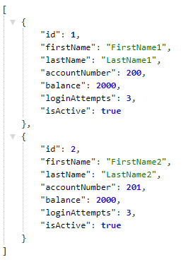
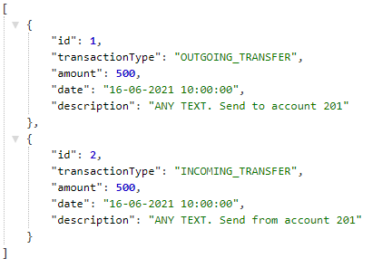

## Table of contents
* [General info](#general-info)
* [Project assumptions](#project-assumptions)
* [Program's idea](#program's-idea)
* [Technologies](#technologies)
* [Setup](#setup)
* [Endpoint list](#endpoint-list)
* [List of objects](#list-of-objects)
* [Screenshots](#screenshots)

## General info
This project is a RESTful bank application.
	
## Project assumptions
* Use SQL Database to storage the data
* Use Spring Security
* Use Spring AOP
* Use Hibernate
* Use JUnit 5

## Program's idea
* Every customer can create the account 
* Every customer can get all information about their own account
* Every customer can perform banking operations such as deposit money, withdraw money, check balance, transfer between accounts.
* Only the administrator can get information about accounts, customers, latest transactions.
* Block third party activities on the account.

## Technologies
Project is created with:
* Java 8
* Spring
* Hibernate
* JUnit 5
* MySQL

## Setup
Clone the repo from github:

```
$ git clone https://github.com/damian12321/bank
```

You can run the application on your favourite IDE using an application server such as Tomcat.
The app will start running at http://localhost:8080.
You can also create a .war file 

```
$ mvn clean package
```

and deploy it directly to the application server.
You can test the application by Postman 
https://www.postman.com/
or use my own bank client application
https://github.com/damian12321/bank-client

## Endpoint list

```
GET    /api/account                                                              - get all accounts, only for administrator
PUT    /api/account                                                              - update account
          param: Account object
POST   /api/account                                                              - add new account
          param: Account object
GET    /api/account/number                                                       - get free account number
DELETE /api/account/{accountId}                                                  - delete specific account
          param: int accountId
GET    /api/account/{accountId}/{pinNumber}                                      - get information about specific account
          param: int accountId, int pinNumber
GET    /api/customer                                                             - get all customers, only for administrator
PUT    /api/customer                                                             - update customer
          param: Customer object
POST   /api/customer                                                             - add new customer
          param: Customer object
DELETE /api/customer/{customerId}                                                - delete specific customer
          param: int customerId
GET    /api/customer/{customerId}/{customerPassword}                             - get information about specific customer
          param: int customerId, String customerPassword
POST   /api/deposit/{accountNumber}/{pinNumber}/{amount}                         - deposit money
          param: int accountNumber, int pinNumber, double amount
GET    /api/transaction                                                          - get all transactions, only for administrator
PUT    /api/transaction                                                          - update transaction
          param: Transaction object
POST   /api/transaction                                                          - add new transaction
          param: Transaction object
GET    /api/transaction/{transactionId}                                          - get specific transaction
          param: int transactionId
DELETE /api/transaction/{transactionId}                                          - delete specific transaction
          param: int transactionId
POST   /api/withdraw/{accountNumber}/{pinNumber}/{amount}                        - withdraw money
          param: int accountNumber, int pinNumber, double amount
POST   /api/transfer/{fromAccountNumber}/{pinNumber}/{toAccountNumber}/{amount}/ - transfer money to other account 
          param: int fromAccountNumber, int pinNumber, int toAccountNumber, double amount, String object as a description
```

## List of objects
List of objects saved as JSON 

```
Customer
{
"id": int,
"firstName": "String",
"lastName": "String",
"account": Account object,
"password": "String"
}

Account
{
"id": int,
"accountNumber": int,
"pinNumber": int,
"balance": double,
"loginAttempts": int,
"isActive": boolean,
"transactionList": [Transaction objects]
}

Transaction
{
"id": int,
"transactionType": "String",
"amount": double,
"date": "Date object",
"description": "String"
}
```
## Screenshots
Example result of GET /api/account 


Entity Relationship Diagram

